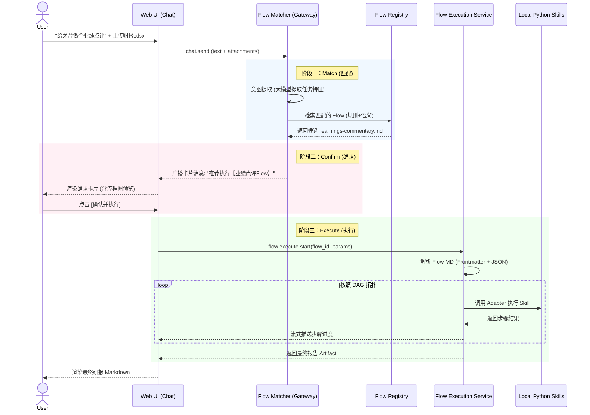

# SWClaw Flow 全链路设计与实施规划：Match -> Confirm -> Execute

为了实现“用户自然语言输入 -> 自动匹配可用逻辑 -> 用户审阅确认 -> 确定性执行出报告”的闭环体验，我们将系统分为三大核心阶段：**意图匹配层 (Match)**、**交互确认层 (Confirm)**、**确定性执行层 (Execute)**。

本规划聚焦于如何在 OpenClaw 现有架构上，以最少侵入的方式实现这三层闭环。

***

## 1. 整体流转架构 (The Big Picture)

***

## 2. 阶段一：Flow Match (意图匹配层)

**核心目标**：准确理解用户意图，从库中找出最适合的 Flow，并提取用户提供的数据作为 Flow 的输入参数。

### 2.1 模块职责

- **意图提取器 (Intent Extractor)**：利用 LLM 将用户自然语言转化为结构化特征（例如：`{ "task": "业绩分析", "target": "贵州茅台", "data_type": ["excel"] }`）。
- **Flow 注册表 (Registry)**：维护所有可用 Flow 的元数据索引（名称、描述、输入要求）。
- **打分排序器 (Scorer)**：将用户意图与 Flow 索引进行比对，返
- 回 Top N 候选。

### 2.2 推荐实施路径 (MVP)

不要一上来就搞复杂的向量检索，建议**先用 LLM Function Calling 做“智能路由”**。

1. 将所有可用的 Flow（比如当前两个：`earnings-commentary`, `market-environment-china`）的 `name` 和 `description` 组装成一段 System Prompt 里的 Tool 描述。
2. 用户的请求进来时，大模型通过调用这个特殊的“路由 Tool”，决定选用哪个 Flow，并将提取的参数填入。
3. **OpenClaw 结合点**：利用 OpenClaw 现有的 Hook 机制（`before_prompt_build`），在聊天入口劫持请求，先走一轮“路由判断”。

***

## 3. 阶段二：Flow Confirm (交互确认层)

**核心目标**：消除 AI 的幻觉风险，让分析师在执行前看清“即将发生的逻辑”，掌握控制权。

### 3.1 交互设计 (Web UI)

当 Matcher 选定 Flow 后，不要直接执行，而是向 Web UI 下发一条**特殊格式的 Message**（例如带有特定 `type: "flow_proposal"` 的卡片）。
卡片需包含：

- **匹配到的 Flow 名称与描述**。
- **预检参数**：例如“已识别输入：`financial_report_files` = `['maotai_2023.xlsx']`”。
- **可视化预览**：提取该 Flow Markdown 中的 Mermaid 代码块，在前端渲染为流程图。
- **操作按钮**：`[确认执行]` / `[取消]`。

### 3.2 OpenClaw 结合点

- **后端**：复用 OpenClaw 现有的 `exec.approval.request`（两阶段审批机制）。网关发起一个审批请求，等待前端决断。
- **前端**：拦截这个特定的审批请求，渲染上述自定义卡片。用户点击确认后，通过 `exec.approval.resolve` 通知网关放行。

***

## 4. 阶段三：Flow Execution Service (确定性执行层)

**核心目标**：替代当前的 `run_flow.py`，提供一个广泛适配、不依赖硬编码、且能向前端推送进度的底层引擎。

### 4.1 核心模块拆解

1. **Flow Loader (解析器)**
   - **职责**：读取 `.md` 文件，提取 Frontmatter (元数据) 和 Execution Plan (JSON 数组)。
2. **Template Resolver (变量渲染器)**
   - **职责**：执行前，将 JSON 参数中的 `{{inputs.xxx}}` 或 `{{steps.clean.output}}` 替换为真实的上下文数据。
3. **Adapter Registry (技能适配器中心 - 关键扩展点)**
   - **职责**：统一的技能调用入口。摒弃 `if skill == 'clean-data-xls'` 的硬编码。
   - **设计**：实现一个通用的 `PythonScriptAdapter`。只要 Flow JSON 里声明了 `skill: "xxx"`，引擎自动去 `skills/xxx/scripts/` 下寻找入口脚本并拼接参数执行。
4. **Runtime Engine (调度器)**
   - **职责**：按 JSON 数组顺序执行，处理 `map` 循环，累积上下文。每完成一步，向 Web UI 广播事件。

### 4.2 OpenClaw 结合点

- 将该服务作为一个新的 **Gateway Plugin** 或内部 Service 注入。
- 新增 RPC 路由：`flow.execute.start`。
- 执行期间，通过 `server.broadcast("chat", ...)` 下发带有 `step_progress` 标签的消息，前端 UI 据此更新节点状态（如将流程图中正在执行的节点标绿）。

***

## 5. 落地执行路线图 (Action Plan)

为确保平稳过渡，建议分为三个 Milestone 推进：

### Milestone 1: 执行内核升级 (脱离旧版 run\_flow\.py)

*目标：先让底层引擎“正规化”。*

1. 使用 TypeScript 在网关层实现 `Flow Loader` 和 `Template Resolver`。
2. 实现 `Adapter Registry` 和通用的 `PythonScriptAdapter`。
3. **验收**：可通过编写简单的测试脚本，调用新引擎成功跑通现有的 `earnings-commentary.md`。

### Milestone 2: 对话式匹配与审批打通 (Match & Confirm)

*目标：打通大模型路由与人工确认卡片。*

1. 编写意图匹配 Prompt，将 Flow 目录下的 MD 摘要作为可选项喂给大模型。
2. 在 `chat.send` 链路中插入拦截器：识别到属于 Flow 任务时，挂起当前对话，发起 `exec.approval`。
3. 修改 Web UI，捕获审批事件，渲染带有 Mermaid 图表的“Flow 确认卡片”。
4. **验收**：用户输入指令，界面弹出确认卡片，点击取消能正常阻断。

### Milestone 3: 全链路闭环与状态推送 (Execute Stream)

*目标：确认后无缝执行，并提供“可见的进度”。*

1. 用户点击“确认”后，将审批结果传递给 `FlowExecutionService` 启动运行。
2. 在 `Runtime Engine` 的步进循环中，插入 WebSocket 广播。
3. Web UI 监听广播，实时更新确认卡片中的状态（或在聊天流中追加进度条）。
4. 执行完毕，回传最终 Markdown 报告路径，前端渲染。
5. **验收**：完整的“对话 -> 弹卡确认 -> 进度滚动 -> 报告展示”端到端体验。

