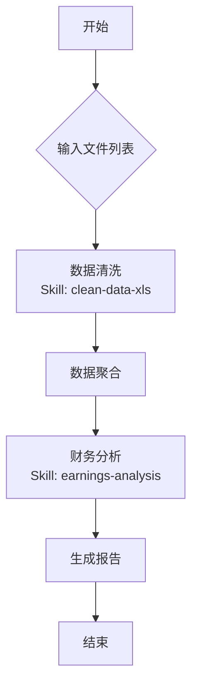

# 业绩点评Flow

该流程旨在自动化分析上市公司财报。

1.  它首先使用 **[clean-data-xls]** 技能清洗用户上传的一个或多个 Excel 数据文件，确保数值格式正确、去除空白行和修正异常值；
2.  然后调用 **[earnings-analysis]** 分析技能，基于清洗后的数据计算关键财务指标（如营收增长率、净利润率、毛利率变动等），并结合历史数据进行同环比分析；
3.  最后基于分析结果，自动撰写并生成一份 Markdown 格式的专业业绩点评报告。

## 流程图 (Visualization)



## 执行步骤 (Execution Plan)

```json
[
  {
    "id": "clean_step",
    "name": "批量清洗 Excel 数据",
    "type": "map",
    "items": "{{inputs.financial_report_files}}",
    "skill": "clean-data-xls",
    "params": {
      "file_path": "{{item}}",
      "action": "normalize",
      "output_dir": "./cleaned_data/"
    },
    "output_key": "cleaned_files"
  },
  {
    "id": "analyze_step",
    "name": "执行财务分析与点评",
    "skill": "earnings-analysis",
    "params": {
      "data_sources": "{{clean_step.cleaned_files}}",
      "analysis_type": "comprehensive_review",
      "output_format": "markdown"
    },
    "output_key": "final_report_path"
  }
]
```
