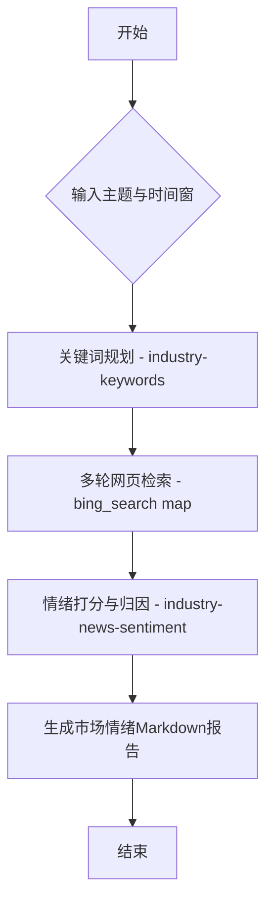

# 国内市场情绪研判Flow

该流程用于围绕“政策风向 + 行业事件 + 情绪评分”生成可复用的市场情绪研判结论。

1.  先通过 **[industry-keywords]** 提示增强大模型，规划用于检索的关键词与查询语句；
2.  再调用 **[bing_search]** 按查询语句进行多轮网页检索，覆盖证监会、央行、发改委、官媒与行业事件；
3.  最后使用 **[industry-news-sentiment]** 结合 Bing 检索内容完成情绪评分与归因，并输出 Markdown 报告。

## 流程图 (Visualization)



## 执行步骤 (Execution Plan)

```json
[
  {
    "id": "keyword_step",
    "name": "规划检索关键词与查询语句",
    "skill": "industry-keywords",
    "params": {
      "topic": "{{inputs.analysis_topic}}",
      "lookback_days": "{{inputs.lookback_days}}",
      "task": "请输出JSON数组，仅包含用于Bing检索的查询语句，每条不超过40字。要求：覆盖证监会/央行/发改委政策、证券时报/中证报风向、行业重大事件；并优先使用站点限定词site:csrc.gov.cn、site:pbc.gov.cn、site.ndrc.gov.cn、site:stcn.com、site:cs.com.cn。",
      "output_type": "json_array"
    },
    "output_key": "queries"
  },
  {
    "id": "bing_step",
    "name": "按查询语句执行Bing检索",
    "type": "map",
    "items": "{{keyword_step.queries}}",
    "skill": "bing_search",
    "params": {
      "_positional": ["{{item}}", 10],
      "exclude": "zhihu.com,douyin.com,baidu.com,zhidao.baidu.com"
    },
    "output_key": "bing_results"
  },
  {
    "id": "sentiment_step",
    "name": "基于检索结果进行情绪分析",
    "skill": "industry-news-sentiment",
    "params": {
      "topic": "{{inputs.analysis_topic}}",
      "search_input": "{{bing_step.bing_results}}",
      "output_format": "markdown",
      "output_file": "{{inputs.output_path}}"
    },
    "output_key": "final_report"
  }
]
```
