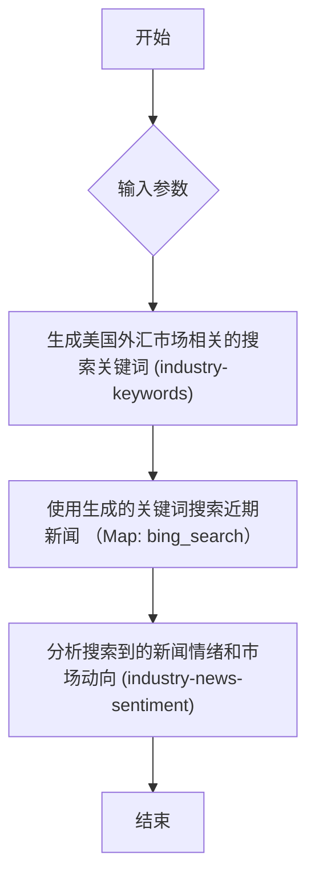

# 美国外汇市场动向分析

通过搜索和分析近期美国外汇市场相关新闻，研判市场情绪和关键动向

## 流程图 (Visualization)



## 执行步骤 (Execution Plan)

```json
[
  {
    "id": "step_1_generate_keywords",
    "name": "生成美国外汇市场相关的搜索关键词",
    "type": "task",
    "skill": "industry-keywords",
    "params": {
      "topic": "{{inputs.analysis_topic}}",
      "lookback_days": "{{inputs.lookback_days}}",
      "task": "生成用于搜索近期市场动向、政策变化、汇率波动相关新闻的关键词数组",
      "output_type": "json_array"
    },
    "output_key": "search_keywords"
  },
  {
    "id": "step_2_search_news",
    "name": "使用生成的关键词搜索近期新闻",
    "type": "map",
    "skill": "bing_search",
    "params": {
      "_positional": [
        "{{item}}",
        10
      ]
    },
    "items": "{{step_1_generate_keywords.search_keywords}}",
    "output_key": "search_results"
  },
  {
    "id": "step_3_analyze_sentiment",
    "name": "分析搜索到的新闻情绪和市场动向",
    "type": "task",
    "skill": "industry-news-sentiment",
    "params": {
      "topic": "{{inputs.analysis_topic}}",
      "search_input": "{{step_2_search_news.search_results}}",
      "output_format": "markdown"
    },
    "output_key": "sentiment_analysis_report"
  }
]
```
