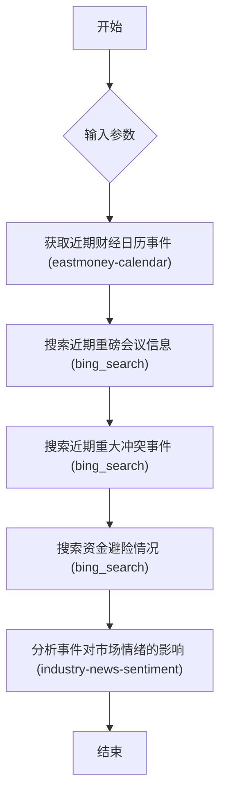

# 重磅事件与资金避险分析

搜索分析近期重磅会议、冲突事件及市场资金避险情况

## 流程图 (Visualization)



## 执行步骤 (Execution Plan)

```json
[
  {
    "id": "step_1_calendar",
    "name": "获取近期财经日历事件",
    "type": "task",
    "skill": "eastmoney-calendar",
    "params": {},
    "output_key": "calendar_events"
  },
  {
    "id": "step_2_search_meetings",
    "name": "搜索近期重磅会议信息",
    "type": "task",
    "skill": "bing_search",
    "params": {
      "_positional": [
        "美联储议息会议 央行会议 重磅政策会议 接下来几天",
        "{{inputs.lookback_days}}"
      ]
    },
    "output_key": "meetings_search_results"
  },
  {
    "id": "step_3_search_conflicts",
    "name": "搜索近期重大冲突事件",
    "type": "task",
    "skill": "bing_search",
    "params": {
      "_positional": [
        "地缘政治冲突 军事冲突 重大国际事件 最近发生",
        "{{inputs.lookback_days}}"
      ]
    },
    "output_key": "conflicts_search_results"
  },
  {
    "id": "step_4_search_safe_haven",
    "name": "搜索资金避险情况",
    "type": "task",
    "skill": "bing_search",
    "params": {
      "_positional": [
        "资金避险 黄金 美元 国债 资金流向 市场避险情绪",
        "{{inputs.lookback_days}}"
      ]
    },
    "output_key": "safe_haven_search_results"
  },
  {
    "id": "step_5_analyze_events",
    "name": "分析事件对市场情绪的影响",
    "type": "task",
    "skill": "industry-news-sentiment",
    "params": {
      "topic": "全球宏观事件与资金避险",
      "search_input": {
        "calendar": "{{step_1_calendar.calendar_events}}",
        "meetings": "{{step_2_search_meetings.meetings_search_results}}",
        "conflicts": "{{step_3_search_conflicts.conflicts_search_results}}",
        "safe_haven": "{{step_4_search_safe_haven.safe_haven_search_results}}"
      },
      "output_format": "markdown"
    },
    "output_key": "final_analysis_report"
  }
]
```
