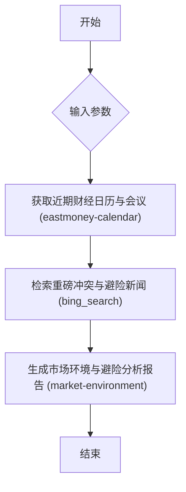

# 重磅事件与避险分析

基于日历与新闻对市场避险情况进行研判：搜索分析接下来几天是否有重磅会议(如美联储议息等)，以及是否刚发生过重磅冲突，资金避险情况如何?

## 流程图 (Visualization)



## 执行步骤 (Execution Plan)

```json
[
  {
    "id": "step_1_calendar",
    "name": "获取近期财经日历与会议",
    "skill": "eastmoney-calendar",
    "params": {
      "size": 100
    },
    "output_key": "calendar_data"
  },
  {
    "id": "step_2_search",
    "name": "检索重磅冲突与避险新闻",
    "skill": "bing_search",
    "params": {
      "_positional": [
        "{{inputs.analysis_topic}} 重磅会议 冲突 资金避险",
        8
      ]
    },
    "output_key": "news_results"
  },
  {
    "id": "step_3_environment",
    "name": "生成市场环境与避险分析报告",
    "skill": "market-environment",
    "params": {
      "output_path": "{{inputs.output_path}}"
    },
    "output_key": "final_report"
  }
]
```
